# Heatpump
   * [Setup Weißhaupt indoor unit](#setup-weißhaupt-indor-unit)
   * [Setup Home assistant](#setup-home-assistant)
   * [Modbus configuration](#modbus-configuration)

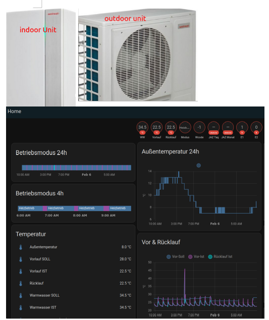

Here I share how to integrate a **Weißhaupt Split-HeatPump** (Weißhaupt Split-Wärmepumpe) into the Home Assistnat. My *.yaml files work perfectly for the **WWP-LS-10-BR** however also for the Biblock etc. you can try my work (it might be however that you do have some other parameters availalbe this also depends on your WWP-CPU Version). My work is inspired by [this forum](https://community.home-assistant.io/t/weishaupt-heatpump-integration-via-modbus/436823/144)

## Setup Weißhaupt indoor unit
* Weißhaupt WWP LS 10 BR
* Version WWP-SG V3.0 (see under: )
* Version WWP-CPU V5.2 (see under: )
* in order to use Modbus TCP you need WWP-CPU >=4
* in other versions you do not have the Modubs TCP tile:
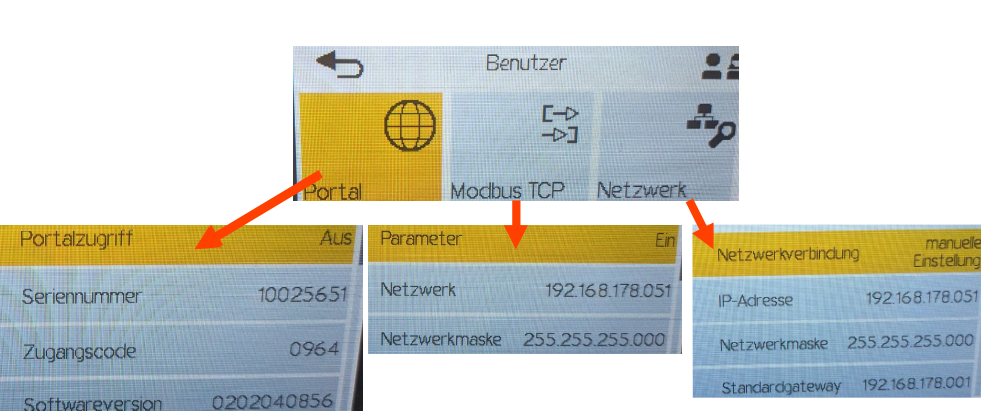
* connect the cable LAN / Modbus to your indoor unit
* setup TCP connection as above (you can choose another ip as well but make sure to be consistent)
* on your router (fritz box) activate port 502 (Portfreigabe) for your Weißhaupt heatpump it should be named *WWP-CPU-....*.
* For a basic connection test try to ping to your ip:
```bash
ping 192.168.178.051
```
* Additionally you can also try this python code:
```python
from pymodbus.client import ModbusTcpClient
import logging
logging.basicConfig()
log = logging.getLogger()
log.setLevel(logging.DEBUG)

WWP = ModbusTcpClient(host='192.168.178.51', port=502) # works with .51 do not use 051
testconnect = WWP.connect()
print(testconnect)
rr = WWP.read_input_registers(42103, 1)
```

## Setup Home assistant
* open Studio Code Server and make sure your files look like mine:
    + *[configuration.yaml](code/configuration.yaml)*
    + *[secrets.yaml](code/secrets.yaml)* create this file if it does not exist.
    + *[integrations/modbus_heatpump.yaml](code/modbus_heatpump.yaml)*
    + *[integrations/templates_heatpump.yaml](code/templates_heatpump.yaml)*
    + *[automations.yaml](code/automations.yaml)*
* in HA -> overview -> edit dashboard -> Raw configuration editor:
    + *[heatpump_dashboard.yaml](code/heatpump_dashboard.yaml)*
* HA -> Settings -> (dots upper right) -> Restart (do a full restart!)
* HA -> Overview now you should see your dashboard displaying the values of your weißhaupt heatpump (see impressions)

## Modbus configuration
for the modbus addresse's see the **[weißhaupt WWP modbus list](modbus_wwp.xlsx)** you can open this file also with libre office.

## Impressions
heatpump_dashboard.yaml:
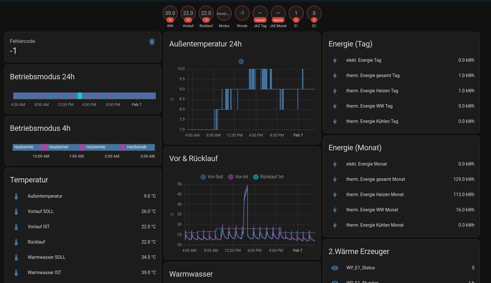

you can increase other views
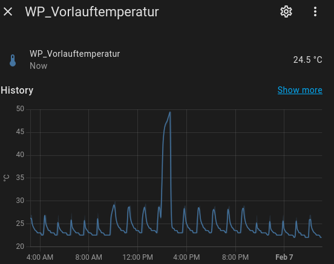


Warmwater push every day at 2pm for 30min.
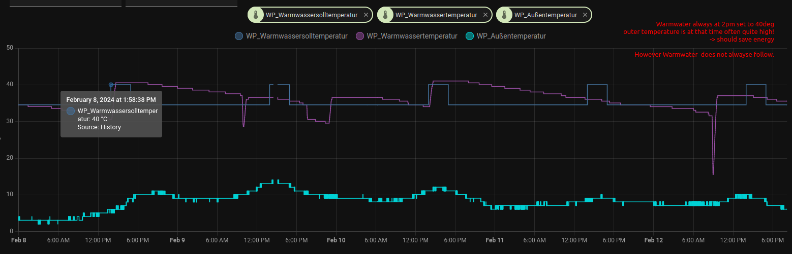


Settings -> automation

the Warm water push automation should show up:

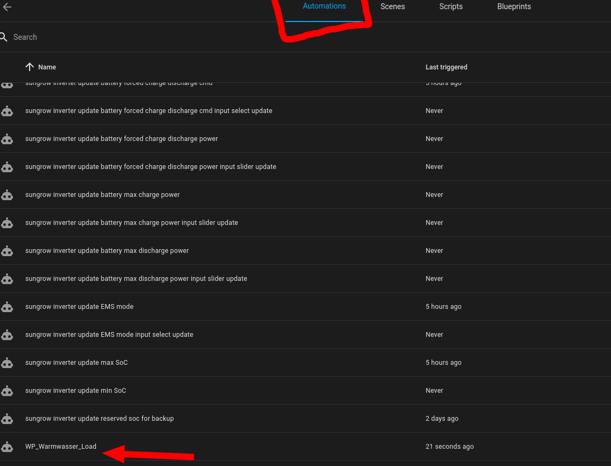

In the transitional period (Übergangszeit) its very beneficial to increase the normal temperature (sollwert temperatur) during the day.
The idea is that when it is warm outside and the your battery is full (in case you have a PV) to produce more heat and heat up your house.
Your house should then store this heat during the night. Thereby your heatpump should not jump on during the night that often and you save a lot of costs.
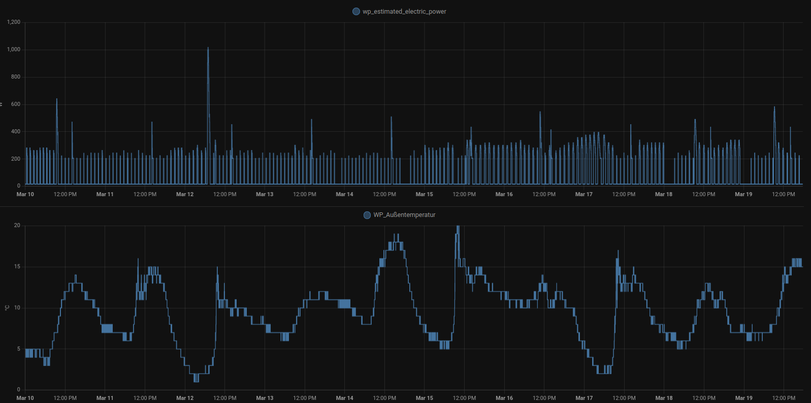

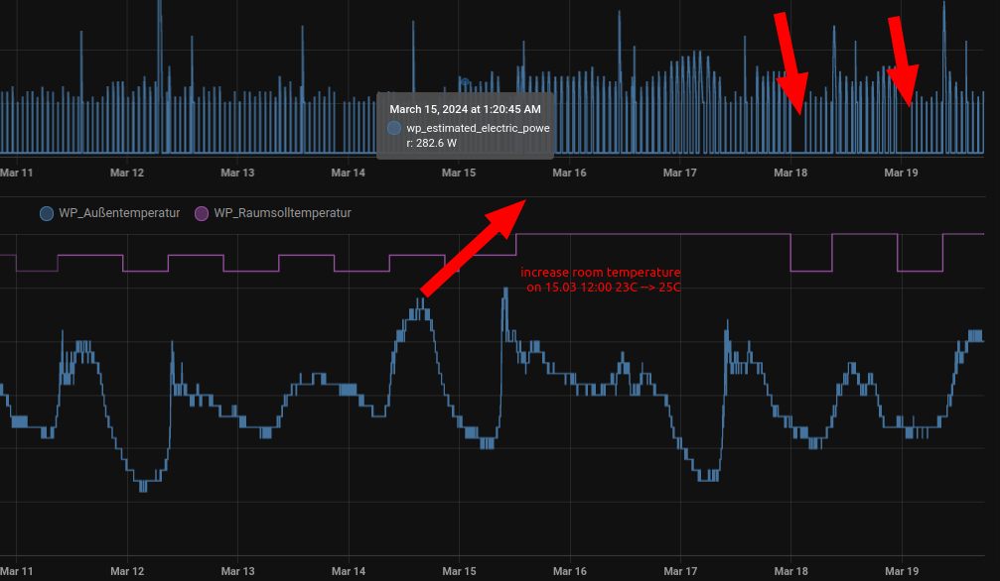

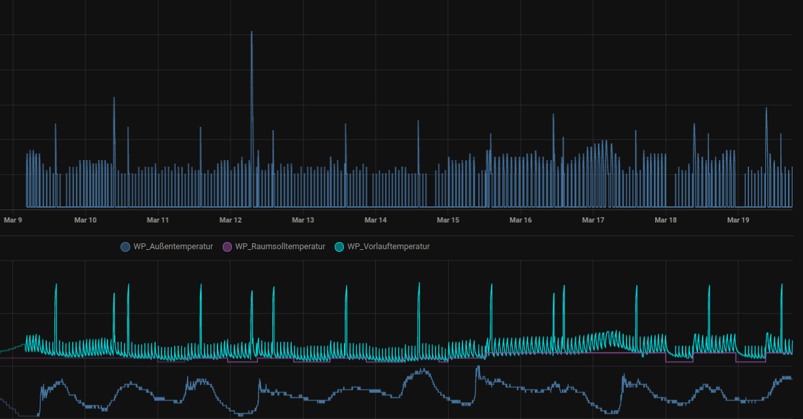
Here you can see that something bad happened during one night the outter temperature was decreasing and the target temperature was increasind during the night! this was energy consuming however on the other days it worked out well.
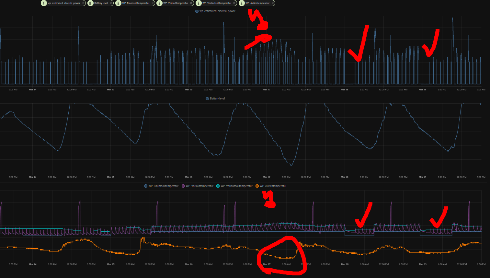

**measuring the electric power of the heatpump**
I use an Eltako power meter to measure the electric power (WW_eltako_power) consumed by the heatpump (Details under sesnsors section). Moreover I use the estimation of the heatpump electric power by rafdev (= heatpump_actual_electric_power).
Displayed values:
* Eltako measurements: WW_eltako_power (value not displayed in the night due to wifi)
* Estimated heatpump electric power (by rafdev): heatpump_actual_electric_powers
* total household consumption: load power (measured with pv inverter)

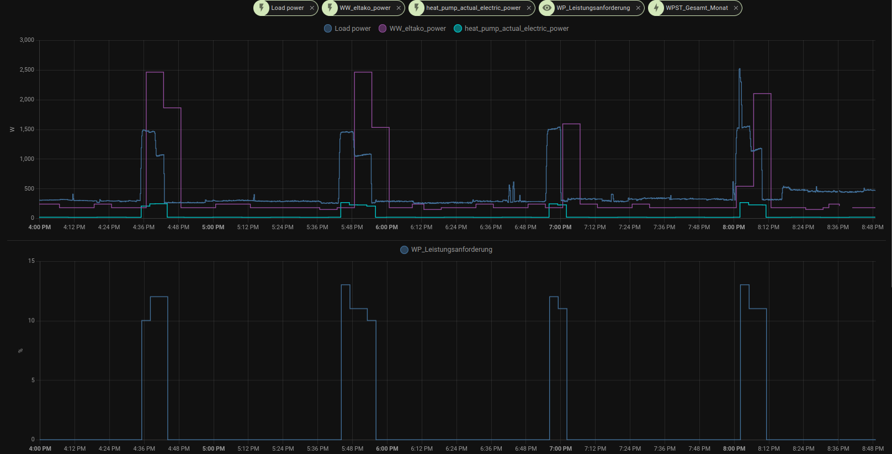

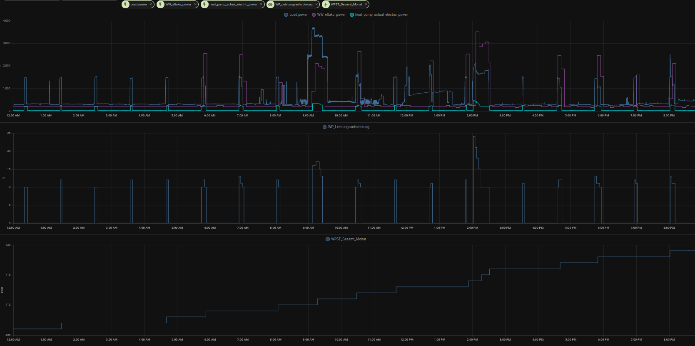


I adapted and scaled both the eltako and the estimated value and I still think the estimated value  is a lot better (not distorted) and also the graphical progression is a lot better.


<!-- 
## TODO
* Teste: 
* heat_pump_electric_power (JAZ Berechnung!) kein Wert wird angezeigt!
* WP_Warmwasser_Load automatisch          WP_Warmwasser_Load
* Teste systembetriebsartChange aendern!  SystembetriebsartChange

* save data to a db? how long is the data stored in HA? 


    # - name: "wp_estimated_electric_power_adapted"
    #   unit_of_measurement: "W"
    #   device_class: power
    #   state: >
    #     
    #     
    #     
    #     
    #     {{ result }}

    # - platform: integration
    #   source: sensor.wp_estimated_electric_power
    #   name: wp_estimated_electric_power_day
    #   unit_prefix: k
    #   round: 2
    #   unit_time: d

-->
