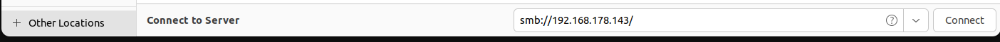
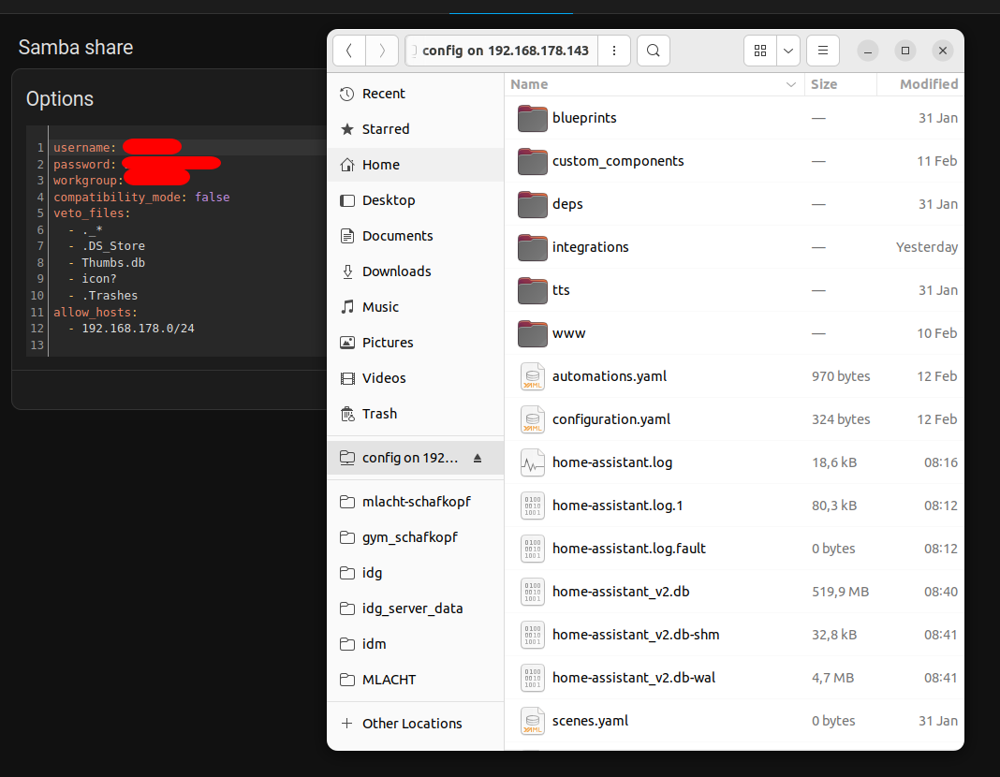

# Lacht HA
With [Home Assistant](https://www.home-assistant.io/)(HA) you can display your heatpump data in a nice way. Besides that you can of course also use ioBroker, python scripts (see above), or other smart home software.
Here I explain only how setup your smart home using Home Assitant this includes:
* [heatpump](heatpump/readme.md) (in my case a Weißhaupt one)
* [pv](pv/readme.md) inverter, Photovoltaik - Solar panels
* [sensors](sensors/readme.md)  (power meter, cameras, temperature sensors, eltako etc.)

## Heatpump
Detailed instructions in the **[heatpump folder](heatpump/readme.md)**


## Photovoltaik (PV)
comming soon

Detailed instructions in the **[pv](pv/readme.md)**

## Other sensors
comming soon. 

Detailed instructions in the **[sensors](sensors/readme.md)**

* use this for tasmota: https://www.home-assistant.io/integrations/mqtt/#mqtt-discovery

## How to configure HA
* Download and install HA as docker or as full OS on a home server pc (that has to run full time!)
* in HA: Settings Apps -> install *Studio Code Server* or *File editor* or use the

### Addons I use

### Samba Share
see [here](https://www.youtube.com/watch?v=Ip7wrj31nvQ) and [here](https://community.home-assistant.io/t/mount-remote-smb-share-on-hassio/116734/11?page=8)



```bash
umountha()
{
sudo umount -a -t cifs
}

mountha()
{
# Replace these with your actual values
SERVER_NAME="192.168.178.145"
SHARE_NAME="config"
MOUNT_POINT="/home/markus/Desktop/lachtHA/config"
USERNAME="your_username"
PASSWORD="your_password"

mkdir -p $MOUNT_POINT
if mount | grep -q "$MOUNT_POINT"; then
  echo "Share is already mounted at $MOUNT_POINT"
else
  echo "Share is not mounted --> Mount it"
  sudo mount -t cifs //$SERVER_NAME/config $MOUNT_POINT -o username=$USERNAME,password=$PASSWORD
fi
}
```

### Visual Studio Addon
[visual code extension](https://www.youtube.com/watch?v=j9Gp2UbQ390)

<!-- 
online: https://github.com/CesMak/lacht_ha
-->