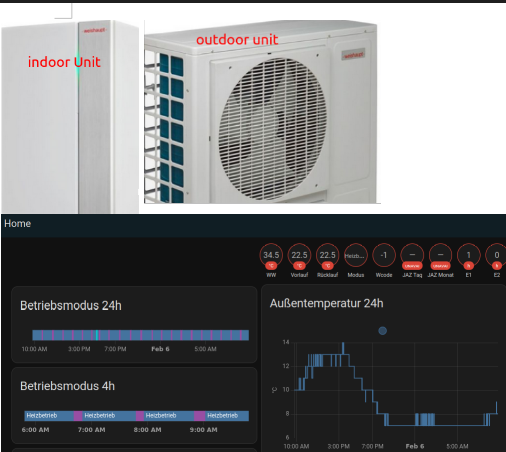

# Lacht HA
My home assistant setup I use to control my PV, my heatpump and some other sensors.

## Heatpump
Detailed instructions in the **[heatpump folder](heatpump/readme.md)**

## Photovoltaik (PV)
comming soon

## Other sensors
comming soon. 

<!-- 

## PV 
* ICloud Solar SH10RT-V112
* Unbedingt auch ISolarCloud integrieren!
* https://www.youtube.com/watch?v=1Ag35KQM5fM
* https://github.com/mkaiser/Sungrow-SHx-Inverter-Modbus-Home-Assistant

* Mein Sungrow ist der SH10RT-V112
* SUNGROW
* Inbetriebnahme 05-30-2023
* -- zwecks sungrow: scan dein netzwerk mal mit advanced ip scanner. so hab ich die IP gefunden. wurde als espressif angezeigt.
* 

online: https://github.com/CesMak/lacht_ha

-->